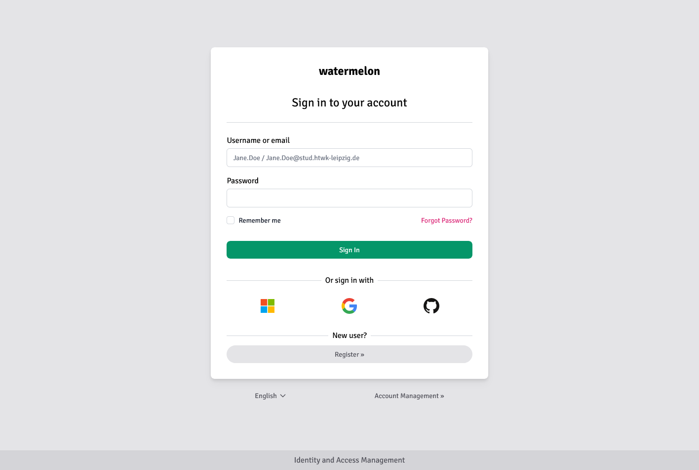

# keycloak-watermelon-theme

This is a Keycloak Theme called "Watermelon" based upon the works of [lukin/keywind](https://github.com/lukin/keywind).
See [CHANGES.md](CHANGES.md) for a coarse overview whats changed.

It is a component-based Keycloak Login Theme built with [Tailwind CSS](https://github.com/tailwindlabs/tailwindcss) and [Alpine.js](https://github.com/alpinejs/alpine).



### Styled Pages

- Login
- Login Config TOTP
- Login IDP Link Confirm
- Login OTP
- Login Reset Password
- Login Update Password
- Login Update Profile
- Login Expired
- Terms and Conditions
- Register
- Error

## Build

When you're ready to deploy your own theme, run the build command to generate a static production build.

```bash
pnpm install
pnpm build
```
